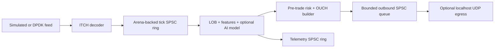

# LUV Flicker

LUV Flicker is a C++20 research and simulation framework for low-latency market-data processing: ITCH decoding, limit-order-book reconstruction, feature extraction, model inference, pre-trade risk checks, and OUCH packet construction. It is **not** connected to a live venue and must not be used to trade without independent compliance, operational, and exchange-certification work.

## Architecture



The simulation executable follows that topology in three concurrent stages:

1. Ingest produces normalized `TickMsg` values with `SimFeedSource`.
2. Strategy consumes ticks, updates the LOB/features, optionally runs a supplied model, and only then asks `ExecutionGateway` to build an OUCH packet.
3. Egress drains fully formed packets before it exits. This avoids the common shutdown bug where accepted packets are lost when strategy work ends.

Outbound UDP is disabled by default. If enabled, the executable sends only to `127.0.0.1`; it never selects or opens an external venue endpoint.

## Build

```bash
cmake -S . -B build
cmake --build build -j
ctest --test-dir build --output-on-failure
```

Run a simulation with no model and no network output:

```bash
./build/luv_engine --messages 100000
```

An optional compatible linear model activates inference and may generate simulated OUCH packets. Add `--udp-port PORT` only when a localhost test receiver is running:

```bash
./build/luv_engine --messages 100000 --model /path/to/model.bin --udp-port 9000
```

## Core components

- `luv_arena.hpp` — fixed-layout `mmap` arena, cache-line-aligned slabs, and large arena-backed SPSC rings.
- `luv_decode_itch.hpp` — normalized Nasdaq ITCH message decoding and symbol table.
- `luv_lob.hpp` — order-reference map and book reconstruction.
- `luv_features.hpp` / `luv_ai.hpp` — feature generation and optional mapped-model inference.
- `luv_execution.hpp` — pre-trade validation and fixed-offset OUCH packet templates.
- `luv_consumer.hpp` — strategy-side orchestration and bounded packet SPSC queue.
- `main_engine.cpp` — safe, simulation-only end-to-end topology.

## Tests

The CMake targets include arena, feed, LOB, execution, AI/telemetry, and stress tests. Performance figures depend on hardware, compiler, memory configuration, and operating-system scheduling; measure them on the deployment platform rather than treating repository claims as guarantees.
